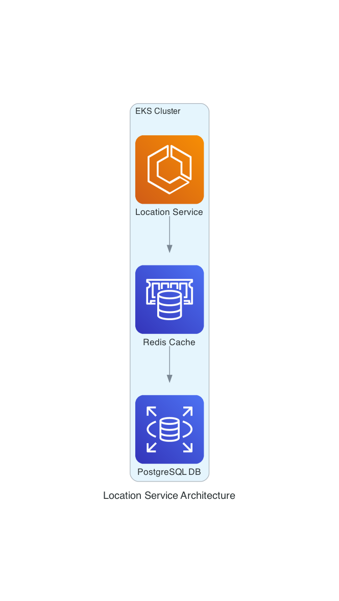

# Location Service

This microservice will be utilized to manage the location data for several applications. The location data will be 
stored in a PostgreSQL database.




To run the integration tests for location-service, from the root directory execute the following

```shell
go test -tags=godog ./cmd/location-service/features
```


## References

