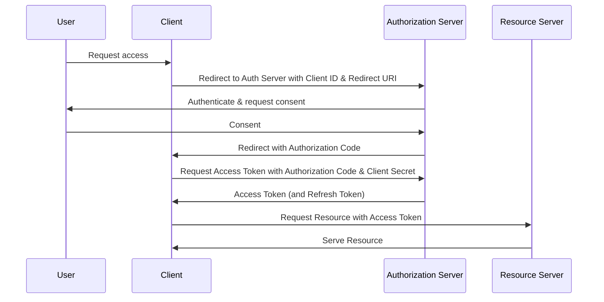

# User Service

## References

* [An Introduction to OAuth2](https://www.digitalocean.com/community/tutorials/an-introduction-to-oauth-2)
* [OAuth2 Crash Course Video](https://www.google.com/search?sca_esv=1402386822cb5d18&sca_upv=1&sxsrf=ADLYWII651docyNpV530v3OIv1Y9ayWRiw:1721165390980&q=implementing+jwt+oauth2+in+gorilla+mux&tbm=vid&source=lnms&fbs=AEQNm0AVbySjNxIXoj6bNaq7uSpwmIS0gJlXN_LWYh5RkW9UG_J2iT2scTJ59gCgVXw95w_JAb-I9YA98pkPPMDYsF9TEp1adEIfdeuT0i415BWx7Eyb8kskuvhVxAm6TIwY4u3anMek-w9Ob1DSg76Ra6D51pZvG_4KotVtznn_G337AZrgm4Iq0ZQjXo2I6P3P9PFzgqCs_Rw_PmDUlVX8OaUFu08NZw&sa=X&ved=2ahUKEwi7n-rdwKyHAxWhHNAFHc9lAV0Q0pQJegQIDxAB&biw=1920&bih=959&dpr=1#fpstate=ive&vld=cid:470af239,vid:oAtjcbE-pMs,st:0)