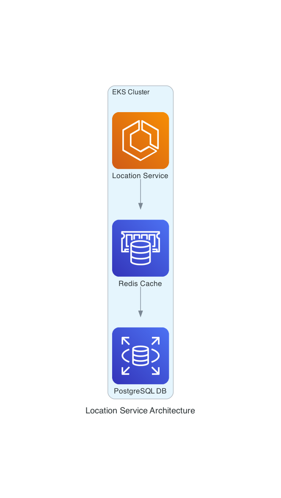

# Location Service

This microservice will be utilized to manage the location data for several applications. The location data will be 
stored in a PostgreSQL database.




To run the integration tests for location-service, from the root directory execute the following

```shell
go test -tags=godog ./services/location-service/features
```

Build the Docker Image for location-service

```shell
docker build -t location-service -f services/location-service/Dockerfile .
```

The Docker build context is the set of files and directories passed to the Docker daemon during th ebuild process of a 
Docker image. When you sissue a ```docker build``` command, Docker client sends these files and directories to the 
Docker daemon, which uses them to build the image. The context is specified by the path you provide at the end of the 
docker build command. So in the above example, the context is the root directory.

For some reason the Docker image has to be built from the root directory.

```shell

## References

